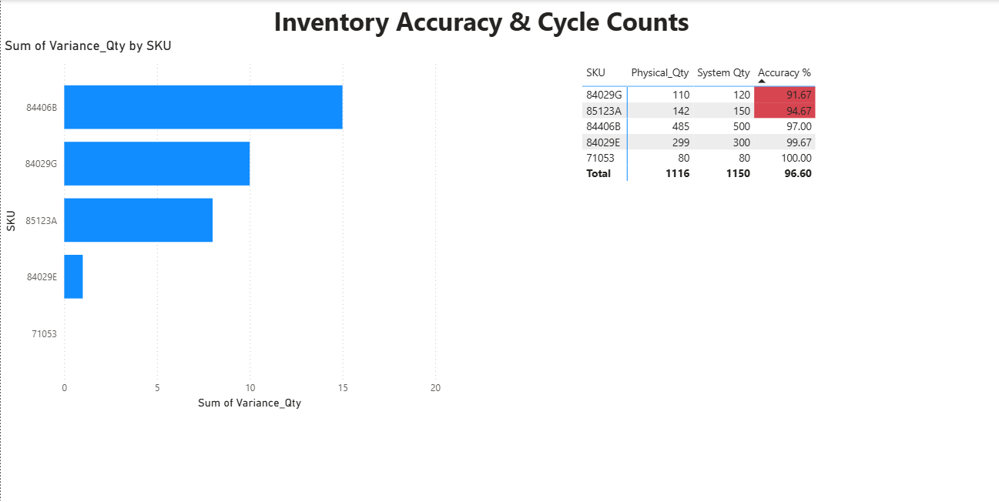
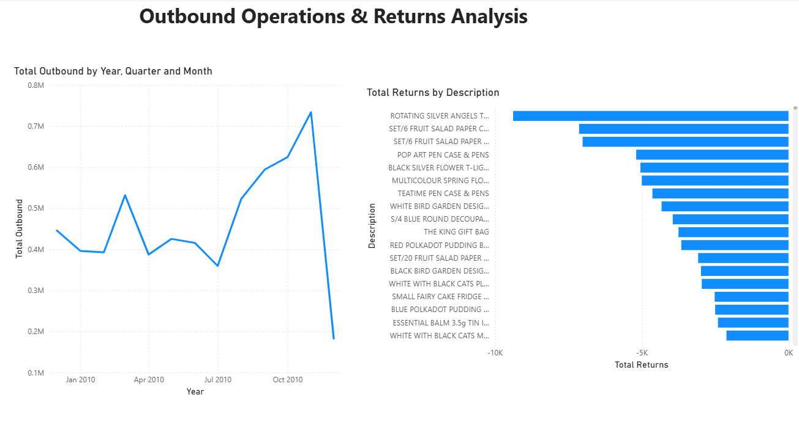

# Supply Chain Operations & Logistics Dashboard

## Cross-Functional Executive Summary
This project is an end-to-end data analytics solution designed to provide leadership with a unified view of supply chain health. By extracting and normalizing over 500,000 rows of retail data using SQL and visualizing the metrics in Power BI and Excel, this dashboard identifies operational bottlenecks from inbound procurement to outbound fulfillment and reverse logistics.


### Key Operational Findings
* **Inbound Operations (Supplier Reliability):** Overall network lead time variance averages 1.00 days late. Granular OTIF (On-Time In-Full) tracking reveals opportunities to consolidate purchase orders with top-performing partners to reduce buffer stock requirements.
* **Warehouse Management (Inventory Integrity):** Cycle count audits revealed isolated SKUs falling below the 95% record accuracy threshold. By implementing automated variance triggers, physical inventory teams can pivot from time-consuming full-facility counts to targeted daily audits on high-risk items.
* **Outbound & Reverse Logistics:** After normalizing outbound flow data and filtering out administrative write-offs, genuine product returns were isolated. The highest physical return volumes are concentrated in a specific subset of decorative SKUs, indicating a need for immediate quality control review prior to the next procurement cycle.

---

## Tech Stack & Architecture
* **Database Management:** MySQL (Data extraction, normalization, and handling missing variables)
* **Business Intelligence:** Power BI (Data modeling, interactive visualizations, and reporting)
* **Data Processing:** DAX (Custom measures for throughput and operational flow), Power Query
* **Data Analysis:** Microsoft Excel (PivotTables, conditional formatting, calculated variance tracking)

---

## Dashboard Architecture & Business Logic

### Page 1: Supplier Performance & Compliance
Designed to track vendor reliability and inbound logistics efficiency.
* **Overall OTIF (On-Time In-Full) Rate:** Aggregated tracking of supplier delivery success.
* **Lead Time Variance:** Measures the average delay in days between expected and actual delivery dates.
* **Defect Tracking:** Highlights non-compliant units by supplier using cross-filtered clustered bar charts to instantly identify poor-performing vendors.


### Page 2: Inventory Health & Cycle Counts
Focuses on warehouse stock reconciliation, shrinkage risks, and physical audit prioritization.
* **Stock Variance Analysis:** Identifies SKUs with the highest physical-to-system stock discrepancies.
* **Cycle Count Accuracy Matrix:** Compares physical counts versus system records.
* **Automated Alerting:** Utilizes conditional formatting rules to automatically flag inventory items falling below a 95% accuracy threshold in red, directing immediate operational focus for physical audits.



### Page 3: Outbound Operations & Reverse Logistics
Analyzes warehouse throughput and filters out administrative noise to uncover genuine product return trends.
* **Outbound Volume Trend:** A drill-down time-series analysis (Year > Quarter > Month > Day) tracking daily warehouse throughput and operational peaks.
* **Return Risk Profiling:** Isolates items causing reverse logistics bottlenecks. 
* **Data Cleaning Implementation:** Advanced visual-level filtering was applied to strip out administrative warehouse adjustments (e.g., "missing", "given away", "Zebra invcing error"), ensuring the visual exclusively highlights genuine product returns.



---

## Repository Structure
* `/sql_queries/`: Contains the sequential SQL scripts used to process the data:
  * `01_database_setup.sql`
  * `02_rebuild_sales_table.sql`
  * `03_import_sales_data.sql`
  * `04_clean_sales_dates.sql`
  * `05_clean_item_descriptions.sql`
  * `06_handle_missing_descriptions.sql`
  * `07_create_analytical_views.sql`
* `/data/`: Contains the secondary Excel data models and scorecard exports.
* `/assets/`: Stores the PDF dashboard export and high-resolution screenshots of the Power BI interface.
* `supply_Chain_Analysis.pbix`: The core Power BI dashboard file containing all DAX measures and interactive visuals.


## Key Technical Implementations

### DAX Measures for Directional Flow
Custom DAX was written to separate standard outbound throughput from reverse logistics within the same unified sales table:

```dax
-- Calculating standard outbound shipping volume
Total Outbound = CALCULATE(SUM(sales[Quantity]), sales[Quantity] > 0)

-- Isolating negative quantities for reverse logistics tracking
Total Returns = CALCULATE(SUM(sales[Quantity]), sales[Quantity] < 0)
```

### Key Performance Indicators (KPIs)
After completing the SQL ETL pipeline, the clean dataset was connected to Excel to evaluate core operational metrics line-by-line:

* **Lead Time Variance:** Calculated the exact deviation in delivery schedules by subtracting the expected delivery date from the actual delivery date (`=E2-D2`), allowing for the tracking of average supplier delays.
* **On-Time In-Full (OTIF) Status:** Engineered a nested logical formula to flag individual orders. Deliveries were marked as "OTIF" only if the actual delivery date was on or before the expected date, and the received quantity perfectly matched the ordered quantity: 
  `=IF(AND(E2<=D2, F2=G2), "OTIF", "Failed")`
* **Inventory Record Accuracy:** Modeled by filtering physical cycle count data against system inventory records, isolating SKUs with a variance of exactly zero to determine true warehouse stock health.
  
```

## Data Cleansing & Transformation
* Replaced NULL or blank vendor IDs and missing order quantities in the raw SQL database prior to BI import.
* Structured relational models connecting `v_supplier_metrics`, `v_inventory_accuracy`, and `sales` fact tables to enable dynamic slicing.

---

## Strategic Recommendations
1. **Targeted Vendor Renegotiations:** Leverage the supplier scorecard data during contract renewals to penalize or replace underperforming vendors.
2. **Dynamic Cycle Counting:** Shift warehouse labor hours toward daily audits of the specific SKUs glowing red on the accuracy report.
3. **Cross-Departmental Quality Review:** Initiate a joint review with Procurement and Quality Assurance focusing on the top three defect-producing suppliers.

---

## How to View This Project
* **View the comprehensive PDF report:** [supply_Chain_Dashboard_Report.pdf](assets/supply_Chain_Dashboard_Report.pdf)
* **Download the interactive dashboard:** [supply_Chain_Analysis.pbix](supply_Chain_Analysis.pbix)

